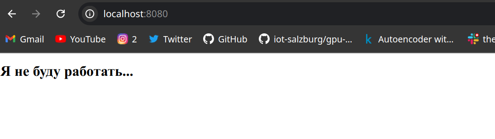

# Лабораторная работа 1 - Docker и Nginx

## Шаги выполнения

### 1. Создание образа `mynginx`
- Соберите Docker-образ `mynginx`, который запускает Nginx внутри контейнера.

### 2. Доступ к Nginx через `http://localhost:8080`
- После сборки и запуска контейнера откройте Nginx по адресу `http://localhost:8080`.

### 3. Использование легковесного образа Alpine
- Используйте образ `alpine:latest` в качестве базового для создания легковесного контейнера.

### 4. Настройка Nginx через внешний конфигурационный файл
- Настройте Nginx с помощью внешнего конфигурационного файла.

### 5. Использование внешнего тома для статических страниц
- Сохраняйте статические страницы (веб-сайты) на внешнем томе.

### 6. Запуск контейнера от непривилегированного пользователя
- Убедитесь, что контейнер запускается от непривилегированного пользователя.

### 7. Создание файла `docker-compose.yml`
- Создайте файл `docker-compose.yml` для запуска и сборки контейнера.

#### Примечание:
Размер докер образа: `docker inspect --format='{{.Size}}' devops_nginx`: 9283701

Вопрос: Что нужно сделать, чтобы после перезапуска сервера (или виртуальной машины) приложение было доступно?
Ответ: Прописать флаг для докера restart always.

